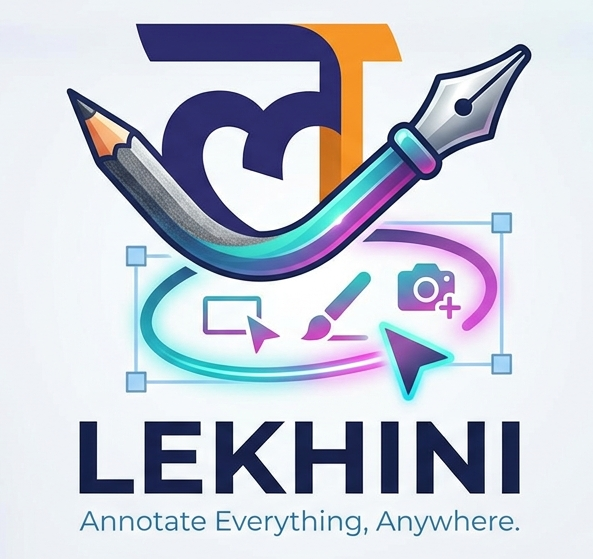

<p align="center">
  
</p>

<h1 align="center">Lekhini</h1>

> लेखनी — Sanskrit for *"pen"*. A free, open-source on-screen
> annotation overlay for macOS, Windows, and Linux. A project of
> [Open Source Bharat](https://opensourcebharat.org). Made in
> India · 2026.

Lekhini lets you draw, write, highlight, and annotate anywhere on
your screen — on top of any application — with a pencil, pen,
highlighter, eraser, and a full set of shape tools. Built for
teachers, presenters, traders, and anyone who needs to mark up live
content without switching apps.

## Highlights

- **Pencil + Pen as distinct tools.** Pencil is graphite-textured with
  uniform width and abrupt taper; pen is smooth ink with
  pressure-driven thinning. Selecting a color while pencil is active
  auto-switches to pen — a clean mental model.
- **Highlighter, eraser, hand (move/select), shapes** (H/V line,
  trendline with Shift-snap, Fibonacci retracement, rectangle,
  ellipse, arrow, text), and **screen snip** with annotations baked
  into the saved PNG.
- **Vertical or horizontal toolbar**, both adapt to content. Vertical
  is the default. The choice is remembered.
- **Tool-aware cursors** that track the active color and width.
- **Per-tool thickness memory** with a quick-pick inline popup.
- **Profiles** — General (default), Teacher, Trader — each surfacing a
  curated tool set.
- **Multi-monitor**, transparent always-on-top overlay, click-through
  by default with a hotkey to toggle drawing.
- **Undo/redo, clear, screenshot**, all from the toolbar or global
  hotkeys.
- **AI, local-first.** Snip anything and **Ask AI** to solve/explain it,
  autocorrect handwriting and typed text, and analyze trader charts —
  running on-device via Ollama by default, with optional cloud providers.
  Everything is opt-in and configured in **Settings → AI**. See
  [docs/AI.md](./docs/AI.md).

## Tech stack

- **Electron 32** — true transparent always-on-top overlay,
  click-through with event forwarding, built-in screen capture
- **SolidJS** — fine-grained signals for the toolbar / UI chrome (no
  VDOM re-renders during draw)
- **TypeScript** + **Vite** + `vite-plugin-electron`
- **`perfect-freehand`** for pen strokes (pressure, velocity-tapered
  polygons), with per-tool input pre-smoothing
- **Zustand** vanilla store with snapshot-based undo/redo history
- **`electron-store`** for persisted orientation / theme / per-tool
  widths / active tool / color, with schema-tolerant hydration
- **Local-first AI** — [Ollama](https://ollama.com) for on-device models,
  with optional cloud providers (Anthropic, OpenAI, Gemini, DeepSeek,
  Sarvam AI). See [docs/AI.md](./docs/AI.md).
- **`electron-builder`** for `.dmg` + `.zip` (macOS), `nsis` (Windows),
  `AppImage` (Linux), and **`electron-updater`** for background
  auto-updates from GitHub Releases

## Architecture

- One **transparent `BrowserWindow` per display** (so Retina /
  non-Retina mixes get correct `devicePixelRatio` per screen).
- Each overlay defaults to click-through ON (`setIgnoreMouseEvents(true,
  { forward: true })`) so the app underneath stays interactive. Toggle
  draw mode (or click the status dot) and clicks land on the overlay.
- A separate **floating toolbar window** (opaque, rounded, draggable)
  hosts the tool palette so it never participates in click-through
  gymnastics.
- A **hub** in the main process owns active tool / draw mode / color +
  width / orientation / profile and broadcasts to all overlays.
- Two-canvas rendering per overlay: a `committed` layer (only redrawn
  on undo/redo/erase) and a `live` layer (cleared every frame) for the
  in-progress stroke.
- All strokes & shapes are kept as a vector `Item` array — undo/redo
  is a snapshot of that array (capped at 100 entries).
- Pointer events captured via `pointerrawupdate` + `getCoalescedEvents()`
  for sub-frame precision, batched on `requestAnimationFrame`.

## Project layout

```
src/
├── main/                          # Electron main process
│   ├── main.ts                    # app lifecycle, display enumeration
│   ├── preload.ts                 # contextBridge -> window.pen
│   ├── hub.ts                     # cross-window state + broadcast
│   ├── persistence.ts             # electron-store wrapper
│   ├── windows/
│   │   ├── overlay.ts             # transparent per-display window factory
│   │   └── toolbar.ts             # floating toolbar window + IPC
│   ├── hotkeys.ts                 # globalShortcut + relay IPC
│   ├── capture.ts                 # desktopCapturer -> save PNG
│   └── permissions.ts             # Screen Recording + Accessibility checks
├── renderer/
│   ├── overlay/                   # overlay window content
│   │   ├── App.tsx                # Solid root, pipeline wiring
│   │   ├── store.ts               # zustand store + undo/redo
│   │   ├── cursors.ts             # dynamic tool-aware cursor builders
│   │   ├── canvas/                # CommittedLayer, LiveLayer, drawItem, pointer pipeline
│   │   └── tools/                 # pencil, pen, highlighter, eraser, line, …
│   └── toolbar/                   # floating toolbar (Solid)
└── shared/                        # types + constants used by both processes
```

## Running locally

```bash
npm install
npm run dev          # starts Vite + Electron with HMR
```

> **Node 26 install note**: `extract-zip` (Electron's postinstall
> extractor) can silently fail to extract nested `.framework` bundles
> on Node 26.x — `node_modules/electron/dist/Electron.app/Contents/Frameworks/`
> ends up empty and Electron fails to launch with `Library not loaded:
> @rpath/Electron Framework.framework`. If you see this, run
> `npm run fix:electron` to re-extract the cached zip with the system
> `unzip` tool. Node 22 LTS does not hit this bug.

On first launch, macOS will prompt for **Screen Recording** (used only
for the screenshot export) and **Accessibility** (used so global
hotkeys work while other apps are focused). Both are optional — denying
Screen Recording just disables screenshot export; denying Accessibility
disables global hotkeys while another app is focused.

If permissions are denied and you want to grant them later:

- System Settings → Privacy & Security → **Screen Recording**
- System Settings → Privacy & Security → **Accessibility**

After granting, quit and relaunch the app.

## Default hotkeys

| Shortcut | Action |
| --- | --- |
| `⌘⇧D` | Toggle draw mode (click-through on/off) |
| `⌘⇧S` | Screenshot + save annotated PNG |
| `⌘⇧C` | Clear current display |
| `⌘Z` / `⌘⇧Z` | Undo / redo |
| `Q` | Pencil |
| `P` | Pen |
| `H` | Highlighter |
| `E` | Eraser |
| `L` | Horizontal line |
| `T` | Trendline (hold `Shift` to snap to 15° / 30° / 45° / 60° / 75° / 90°) |
| `F` | Fibonacci retracement |
| `R` | Region selector |
| `A` | Arrow |
| `X` | Text |

## Profiles

- **General** — pencil, pen, eraser, hand, line, arrow, text,
  rectangle, ellipse, snip.
- **Teacher** — adds highlighter for presentations.
- **Trader** — chart-specific: trendline (Shift-snap), Fibonacci
  retracement, region selector.

Switch profile from **Settings → Profile**. The choice is remembered.

## AI

Lekhini's AI is **local-first and entirely opt-in**. With **Local AI**
on, snips and text never leave your machine; cloud providers are an
optional fallback you configure with your own API key. Nothing AI-related
is enabled until you set one of them up.

**What you can do**

- **Ask AI about a snip** — drag a region, click **Ask AI**, and a chat
  panel opens. It *solves/answers* what's in the image (math, code,
  questions, errors), not just describes it. Follow-up questions keep the
  full conversation context until you start a new snip.
- **Autocorrect** — typed text and recognized handwriting can be cleaned
  up automatically (toggle per kind in Settings).
- **Handwriting recognition** — drawn ink is transcribed to text on
  device via a vision model.
- **Trader analysis** — the Trader profile can hand your drawn levels to
  the AI for a written read.
- **On-device learning (RAG)** — accepted corrections are remembered
  locally to personalize future suggestions. Stored only on your machine.

**Providers**

| Provider | Kind | Vision | Notes |
| --- | --- | --- | --- |
| **Ollama (Local)** | on-device | yes | Default. Private, free, no key. |
| **Anthropic Claude** | cloud | yes | API key required |
| **OpenAI** | cloud | yes | API key required |
| **Google Gemini** | cloud | yes | API key required |
| **DeepSeek** | cloud | no (text) | Strong reasoning; image snips answer from text |
| **Sarvam AI** | cloud | yes (OCR→LLM) | Indic-strong document OCR, then solves |

**Configure** in **Settings → AI**: enable Local AI (a first-run wizard
installs Ollama + recommended models), or pick a cloud provider and paste
its key. Routing is local-first — if Local AI is on and a suitable model
is installed it's used; otherwise the configured cloud provider is.

Full details — architecture, the resolver, per-profile prompts/models,
privacy, and how each provider is wired — are in
**[docs/AI.md](./docs/AI.md)**.

## Updates

Installed builds **auto-update from GitHub Releases** via
`electron-updater`. By default new versions download in the background
and apply on the next quit/relaunch. Manage this in **Settings →
Updates**: toggle **Automatic updates**, **Check for updates** on demand,
or **Restart to update** once a version is downloaded.

> macOS auto-update requires a signed + notarized build. Until signing
> is configured, macOS users update manually (Settings → Updates links to
> the latest GitHub Release); Windows and Linux auto-update out of the box.

## Building installers

Build for the **current OS** (most reliable locally):

```bash
npm run build            # installers for this OS → release/
npm run build:unpacked   # unpacked app dir, no installer (fastest)
```

Per-OS targets (cross-OS locally needs the right toolchains — CI is the
supported path for all three at once):

```bash
npm run build:mac        # release/Lekhini-<ver>-arm64.dmg (+ x64) + .zip
npm run build:win        # release/Lekhini Setup <ver>.exe
npm run build:linux      # release/Lekhini-<ver>.AppImage
npm run build:all         # attempt mac + win + linux (-mwl)
```

Optional **macOS signing + notarization** — set these in your shell (or
as CI secrets) and the build signs automatically; omit them for an
unsigned build:

```bash
export APPLE_ID="you@example.com"
export APPLE_APP_SPECIFIC_PASSWORD="xxxx-xxxx-xxxx-xxxx"
export APPLE_TEAM_ID="ABCDE12345"
export CSC_LINK="path/to/DeveloperIDApplication.p12"
export CSC_KEY_PASSWORD="..."
```

**Automated multi-OS builds + releases** run in CI — pushing a `vX.Y.Z`
tag builds macOS / Windows / Linux in parallel and publishes them to
GitHub Releases. See [RELEASING.md](./RELEASING.md); the one-liner is
`npm run release` (patch) / `release:minor` / `release:major`.

## Hard constraint: macOS fullscreen Spaces

If you put an app into **native fullscreen** (the green-button-with-Cmd
+ Ctrl+F, which moves the app into its own Space), no overlay tool —
Lekhini, Epic Pen, or anything else — can reliably float above it. The
Space is sandboxed.

**Workaround**: use **maximized non-fullscreen** windows. If you
absolutely need fullscreen, disable *"Displays have separate Spaces"*
in System Settings → Desktop & Dock, or use Stage Manager.

## Adding a new tool

1. Create `src/renderer/overlay/tools/<your-tool>.ts` exporting a
   `Tool` (see `pen.ts` for the shape).
2. Add the tool to `src/renderer/overlay/tools/registry.ts`.
3. Add an entry to `ALL_TOOLS` in `src/renderer/toolbar/App.tsx` (id,
   label, hint, icon).
4. Add a hotkey entry in `src/shared/constants.ts` `TOOL_HOTKEYS`.
5. If it needs new shape data, extend the `Item` union in
   `src/shared/types.ts` and add a renderer case in
   `src/renderer/overlay/canvas/drawItem.ts`.

## Contributing

Lekhini is community-owned by
[Open Source Bharat](https://opensourcebharat.org). Issues, ideas,
and pull requests are all welcome at
<https://github.com/opensourcebharat/lekhini>.

For releasing changes once they're merged, see
[RELEASING.md](./RELEASING.md).

## License

MIT — see [LICENSE](./LICENSE). Free for anyone to use, modify, and
distribute, including commercially. Made in India · 2026.

## Versioning

Lekhini follows [Semantic Versioning](https://semver.org). The current
version lives in `package.json` and is shown in **Settings → About**.
Release process and policy: see [RELEASING.md](./RELEASING.md).
